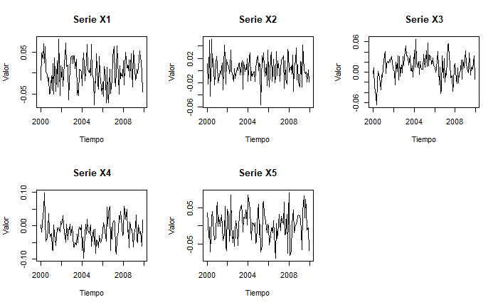
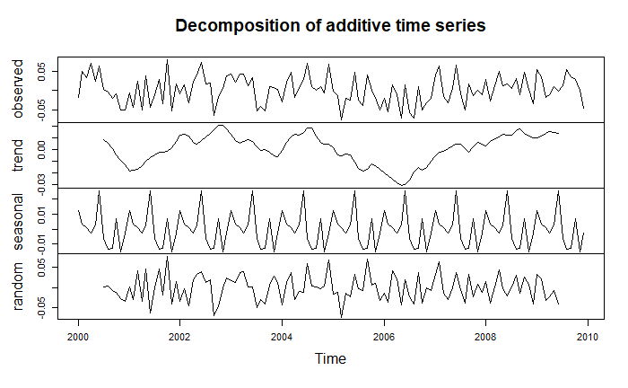
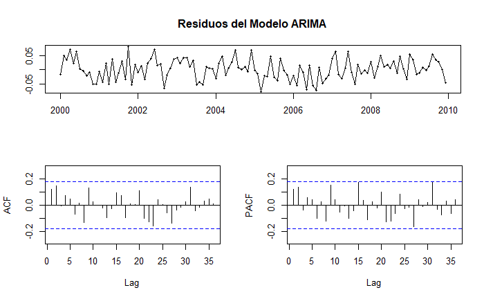
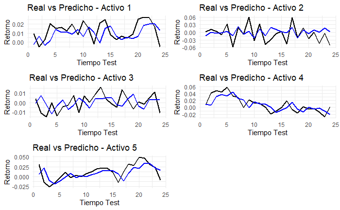
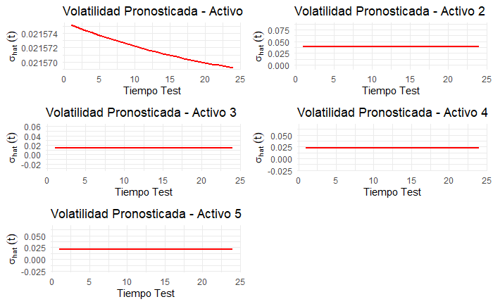
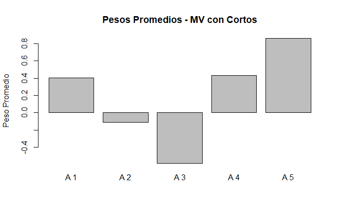

```{r setup, include=FALSE}
knitr::opts_chunk$set(echo = TRUE)
```

Para poder hacer un pronóstico de los rendimientos futuros de los 5 activos del CSV stock_returns_trains_2.csv hemos empleado modelos ARIMA univariados, ajustados mediante la función `auto.arima` (correspondiente a la librería: `forecast`). Esto lo que nos quiere decir es que si el rendimiento de hoy depende un poco del rendimiento de ayer, el modelo ARIMA lo detecta, ya que nuestro modelo ARIMA lo que hace es detectar los patrones en el tiempo, todo y que estos patrones sean o no insignificantes. Además, hay que tener en cuenta que ARIMA NO sobreajusta, no se inventa patrones inexistentes. Lo explicado con anterioridad es adecuado para series financieras con autocorrelación débil.

A partir de esto, pudimos obtener dos variables fundamentales:

- El rendimiento esperado del activo (\(\mu_t\)), es decir, lo que el modelo anticipa que podría ocurrir
- La desviación estándar (\(\sigma_t\)), que refleja el nivel de riesgo asociado a esa predicción.

Para poder comprobar todo estuviera bien ajustado, hemos procedido a comprobar los residuos con dos pruebas estadísticas habituales en series temporales:  

- Ljung–Box (mediante Box.test) --> que detecta si queda autocorrelación no explicada  
- ARCH (mediante ArchTest de la libreria *FinTS*) --> revisa si existe heterocedasticidad

Con esto podemos verificar que nuestro trabajo es razonable, y gracias a esto podemos verificar los apartados 2,3 y 4.

En el apartado 2, usamos la función `getPred()`, la cual nos ajusta un modelo ARIMA con los datos del activo para posteriormente actualizar los datos con la información más reciente hasta el día \(t-1\) (con el fin de tener los datos mas actuales posibles). A partir de este modelo (ya actualizado) se obtiene:

- una predicción del rendimeinto del activo del siguiente día mañana (\(\hat{\mu}_t\))
- una estimación de la incertidumbre del modelo (\(\hat{\sigma}_t\)) --> para saber que tan segura es nuestra predicción

A continuación, tenemos la función `getPred_ts()`. Esta lo que hace es repetir el proceso de predicción día a día y activo por activo. Su procesos es sencillo:

1. Empieza en el primer día del periodo test
2. Calcula la predicción de los activos
3. Guarda los datos
4. Hace lo mismo con el siguiente día, e incorpora toda la información.

Despues "construye" dos matrices:

- `mu_hat` --> Predicción del rendimiento del activo para el día t
- `se_hat` --> Desviación estándar estimada para el día t

Finalmente, se calcula el RMSE para evaluar la calidad de las predicciones. En nuestro caso, el RMSE obtenido fue de 0.0175, lo que indica que, en promedio, el modelo comete un error del 1.75% en la predicción de los rendimientos diarios. Este nivel de error es razonable para datos financieros, que suelen presentar alta volatilidad. 

A continuación se describen las funciones utilizadas para obtener los pesos óptimos, $\alpha_t$, para cada activo en $t=T+1, ..., T+r$ y el rendimiento acumulado total. Tendremos en cuenta dos casos: (3.1) permitiendo posiciones cortas y (3.2) restringiéndolas ($\alpha_t \geq 0$). Para ello se debe optimizar la función utilidad media-varianza, $U_{MV}$, para obtener estos pesos y así obtener el mejor rendimiento mitigando el riesgo. 

Si nos fijamos en la función utilidad media-varianza,
$$U_{MV}=\alpha_t^T\mu_t-\frac{\gamma}{2}\alpha_t^T\Sigma_t\alpha_t,$$
$\mu_t$ corresponden a los valores esperados de los rendimientos calculados en el apartado anterior; $\Sigma_t$ es una matriz calculada a partir de la función `getSigmaMV` (como se indica en el enunciado); $\gamma$ es el coeficiente de aversión al riesgo (que controla el peso que se le da a la varianza).

Ahora bien, considerando el primer caso (permitiendo posiciones cortas), para obtener un peso en un periodo $t$ utilizamos la función `getAlphaMV`. Esta función ha sido determinada a partir del método de los multiplicadores de Lagrange bajo la restricción $\sum_i \alpha_{ti}=1$. Y para calcular los pesos para cada activo, hemos utilizado la función `getAlpha_ts` (proporcionada) donde sus variables de entrada son `mus` ($\mu_t$), `sigs` ($se_{hat}$), $\gamma$ (que hemos fijado a 20, penalizando fuertemente el riesgo), `getSigmaFunc` que es `getSigmaMV`, `getAlphaFunc` es `getAlphaMV`, y `Xtrain` y `Xtest` los rendimientos para train y test. También, dentro de `getAlpha_ts` se llama a la función `getAlpha` que combina las funciones `getAlphaMV` y `getSigmaMV`. Por último, hemos utilizado la función `getChecks` para verificar que se cumple la restricción mencionada anteriormente ($\sum_i \alpha_{ti}=1$).

Y para calcular el rendimiento total hemos utilizado la función `getRet` (proporcionada). En este caso hemos obtenido un rendimiento total de 2.95.

Por otro lado, para el caso de posiciones largas (3.2), hemos realizado exactamente el mismo procedimiento, excepto para el cálculo de $\alpha_t$ ya que tenemos que tener en cuenta que solo se consideran valores positivos (además de la restricción de la suma de todos los pesos). Hemos utilizado la función `getAlphaMVPos` donde se ha hecho uso de `solve.QP` del paquete `quadprog`, que permite resolver problemas de optimización cuadrática sujeta a restricciones lineales.

En este caso hemos obtenido un rendimiento de 0.62. A diferencia del caso anterior donde habíamos obtenido un 2.95. Puede ser debido a que al restringir únicamente a pesos positivos, limitamos más las combinaciones posibles (elimina la posibilidad de de neutralizar riesgo con cortos) y, por tanto, reduce las posibilidades de obtener una mejor rentabilidad.


En un principio se ha hecho un análisis exploratorio y diagnótico de series temporales:
Las cinco series de retornos muestran datos desde 2000 hasta ~2009.
Se graficaron las cinco series temporales para evaluar visualmente su comportamiento. Algunas series muestran fluctuaciones más pronunciadas, lo que sugiere mayor volatilidad. No se observan patrones estacionales evidentes, lo que es coherente con series de retornos financieros.




Se realizó una descomposición aditiva de las series. En estos datos, por lo general, las cinco series muestran comportamiento típico de retornos financieros: fluctuaciones alrededor de cero, sin tendencia clara y con variabilidad irregular. No se observa estacionalidad evidente. Algunas series (como X2 y X4) presentan mayor volatilidad, mientras que otras (como X3) son más estables. El componente aleatorio captura la mayor parte de la variabilidad.

Una visualización con la serie X1 sería la siguiente:


En todas las series temporales se observa que los residuos en el tiempo oscilan alrededor de cero sin patrones visibles, tampoco muestran tendencia ni cambios bruscos de varianza.

El ACF de residuos, la mayoría de los lags están dentro de las bandas de confianza y no hay autocorrelación significativa. Y el PACF de residuos es igual que la ACF: sin picos relevantes. No hay estructura remanente por modelar.


Los gráficos ACF y PACF de la series en general muestran un decaimiento lento  X1 muestran [describe el patrón: por ejemplo, decaimiento lento en ACF y corte abrupto en PACF], lo que sugiere un modelo AR(p) adecuado. Esta información guía la selección de parámetros en el modelo ARIMA.


Los análisis de las series temporales indican que los retornos no exhiben tendencias o estacionalidades notables. Las descomposiciones corroboran que la mayor parte de la variabilidad se origina en el componente aleatorio. Las funciones ACF y PACF señalan que las series son adecuadas para el modelado ARIMA y presentan estacionaridad. Por último, los gráficos de residuos evidencian la falta de autocorrelación y un comportamiento de ruido blanco, lo que confirma que los modelos ARIMA ajustados son adecuados para prever la volatilidad y los retornos.


Los resultados de las predicciones en estos casos nunca son exactos porque en mercados financieros los retornos son muy ruidosos, y el valor esperado suele ser más suave.
En este caso, en la imagen se observa cómo en los 5 activos la línea azul (predicha) es más estable, pues ARIMA filtra el ruido de alta frecuencia.
Concretamente, en los activos 1, 4 y 5 se observan cambios de nivel, ARIMA se está adaptando lentamente (esto puede ser devido a alguna dependencia temporal débil).
Y los activos 2 y 3 son los más cercanos a ruido blanco. Su retorno retorno real oscila al rededor de 0, y su predicción es más aplanada.



La volatilidad de estos activos se estimó como la desviación estándar del pronóstico one-step-ahead.
Dado que ARIMA asume varianza constante en los errores, la volatilidad estimada resulta prácticamente constante en el periodo test para la mayoría de los activos, lo cual es consistente con las hipótesis del modelo.

En la gráfica se observa que el activo 1 se observa una leve pendiente o cambio suave. Esto ocurre porque el modelo ARIMA se reestima dinámicamente al incorporar nuevos datos, la estimación de 
𝜎^2 puede ajustarse ligeramente, especialmente si el modelo incluye integración (d > 0) o cambios en residuos. Con esto se cumple que la diagonal de Σ𝑡será constante en 𝑡, lo cual simplifica la optimización.

En los demás activos, el modelo ARIMA clásico modela la media condicional del proceso, no modela volatilidad dinámica, asume que los errores tienen varianza constante. Es por ello que los intervalos de predicción tienen ancho casi constante, y por lo tanto, la volatilidad pronosticada es prácticamente plana



En la siguiente gráfica se observa la representación de cómo se asiganan los pesos promedio de inversión en cada activo en el perioro de testeo bajo el modelo de utilidad media-varianza con posiciones cortas permitidas.

El activo 5 tiene el peso promedio más alto (~0.8), es decir, posee un rendimiento esperado alto y una volatilidad controlad, el modelo confía bastante en este activo. Los activos 1 y 4 presentan pesos positivos moderados (~0.4), son buenos, pero no hay tanta convicción. Los activos 2 y 3 muestran características menos atractivas (ya sea por bajo rendimiento esperado o alta volatilidad relativa), lo que lleva al modelo a asignarles posiciones cortas.



La gráfica siguiente ilustra cómo ha cambiado el portafolio creado bajo la norma de utilidad logarítmica, cuyo objetivo es optimizar el crecimiento compuesto del capital. Este método, a diferencia de la utilidad media-varianza, castiga con severidad las pérdidas y promueve tácticas más conservadoras en situaciones de volatilidad alta. Para calcular el valor acumulado, se utilizan los rendimientos ponderados por los pesos óptimos en cada momento y, posteriormente, se suman los factores de crecimiento. La curva final muestra una tendencia ascendente, acelerándose al final del periodo, lo cual sugiere que el modelo fue capaz de identificar oportunidades de inversión con buena rentabilidad y modificar dinámicamente la distribución de activos en función del riesgo y el rendimiento esperado.


# Distribución del proyecto

- Apartado 2: Jeremy Joel Aguilar Marin
- Apartado 3: Irene Barba La Orden y Fabián Castillo Calvo
- Apartado 4: Lucía Benages Guijarro
Falta poner a Cristhian


